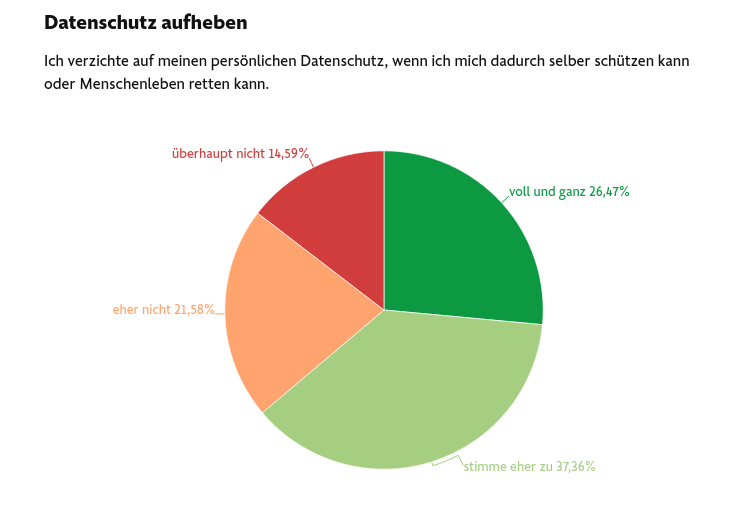

---
categories:
- Ethics and Society
date: "2020-03-16"
displayInList: true
displayInMenu: false
draft: false
dropCap: true
title: COVID-19, another opportunity to do away with privacy
---

Fortunately, there is something good even to COVID-19. Like so many other things that, in the real world, kill real people, it can be misused for propaganda in the name of abolishing basic rights and liberties. A popular victim, nowadays, attacked by [both public and private sector alike](https://medium.com/@zkajdan/the-hard-problem-of-privacy-4bc0f731c16e), is privacy. Would you consent to giving up private information, if that could save lives? Exactly.

A splendid specimen of anti-privacy propaganda appeared last Friday, March 13th, in the [online edition of Frankfurter Allgemeine Zeitung](https://www.faz.net/aktuell/wirtschaft/digitec/virusschutz-ist-deutschen-wichtiger-als-datenschutz-16676494.html) -- arguably, Germany's most reputable newspaper. (Aside: Yes, in spite of GDPR & all, it's not like Europe is _so_ different from the US -- we just lack major surveillance capitalists, on this side of the Atlantic.)

The article in question reports results of a [study](https://usercentrics.com/de/knowledge-hub/corona-umfrage/) conducted by [Usercentrics](https://usercentrics.com/de/), a Munich-based _consent management platform_ (yes, you didn't misread. _Consent_, not content. How else could companies meet the hard requirements imposed by GDPR?). Questions included: 

- "Ich verzichte auf meinen persönlichen Datenschutz, wenn ich mich dadurch selber schützen kann oder Menschenleben retten kann." 
(_I give up personal data protection if I can thus protect myself or save lives._)

And the answers, presented in one of those pie charts we all love: (Answer options are: "voll und ganz" (_absolutely_, 26.47%), "stimme eher zu" (_I rather agree_, 37.36%), "eher nicht" (_not really_, 21.58%), "überhaupt nicht" (_not at all_, 14.59%).

With such a framing, it is surprising that 15% of the people they asked dared say no! ("No, not at all", literally.)
On the other hand, it's great the question didn't go into any specifics on "my personal data protection". Once you're committed, you're committed.

Or:

- "Ich würde freiwillig persönliche Gesundheitsdaten wie Körpertemperatur, Bewegungsprofil oder soziale Kontaktpunkte öffentlichen Institutionen wie z.B. dem Robert-Koch-Institut bereitstellen." 
(_I would voluntarily make available personal health data, like body temperature, movement profile, or social points of contact to public institutions like e.g., Robert-Koch-Institut._) [Robert-Koch institute is a German federal government agency and research institute responsible for disease control and prevention.]

Results: 34.1 % "voll und ganz" (_absolutely_), 33.7% "stimme eher zu" (_I rather agree_), 21.58% "not really" (_eher nicht_), 14.59% "überhaupt nicht" (_not at all_).

Note how this is more specific than the above ("data protection"), but there's a convenient slope. Body temperature, sure; movement data? _All_ movement data? And _social points of contact_? Meaning, every _third person_ I may have encountered?
Also, note the restriction _public institutions, like ..._. What exactly are public institutions? And how about the non-public service providers that _collect_ these data?

One last one.

- "Ich würde Daten aus meinen Social Media Accounts wie Facebook und Instagram freigeben, damit im Verdachtsfall alle meine Kontaktpersonen zuverlässig nachvollzogen und benachrichtigt werden können." (_I would permit access to data from my social media accounts, like Facebook and Instagram, such that it would be possible to reliably track and notify my contacts in case of suspicion._):

15.5 % "voll und ganz" (_absolutely_), 24.4 "stimme eher zu" (_I rather agree_), 26.4% "eher nicht" (_not really_), 33.7% "überhaupt nicht" (_not at all_).

This time, it's not a majority on the "yes" side. Still - what a thought. Or are we missing something? Does COVID-19 spread via the internet?

However that may be, Usercentric CEO Misch Rürup [summarizes](https://usercentrics.com/de/knowledge-hub/corona-umfrage/): "Sollte die Politik digitale Maßnahmen einleiten wollen, mit denen die Corona-Bekämpfung (und zukünftig auch andere Infektionskrankheiten) unterstützt werden soll, so kann sie sich der Rückendeckung der Bevölkerung bewusst sein." (_Should administration want to introduce digital measures to support combating corona (and in the future, other infectious diseases), they may rest assured of the population having their back._)

Well, that's good news. Problem solved.

Apart from presenting the study results in aforementioned pretty pie charts, the article adds a special flavor. The main section is framed by two seemingly non-belonging, clumsy, incoherent episodes. Especially the concluding paragraph is astonishing: The article closes with an incident where it was possible to eavesdrop on an internal, COVID-19 related virtual meeting held by the Bavarian secretary of the Interior -- the virtual meeting room was not password protected.

How's that fit in? Is it just some vague association (maybe the article was just written too fast)? I don't think so. 
That incident is related as an illustration of the usual "digital incompetence" attributed to our politicians. However that may be: It nicely deflects attention from _what_ should be done to _how_. All we lack to successfully restrict privacy is not public consent, it's just the competence to finally do it. 

